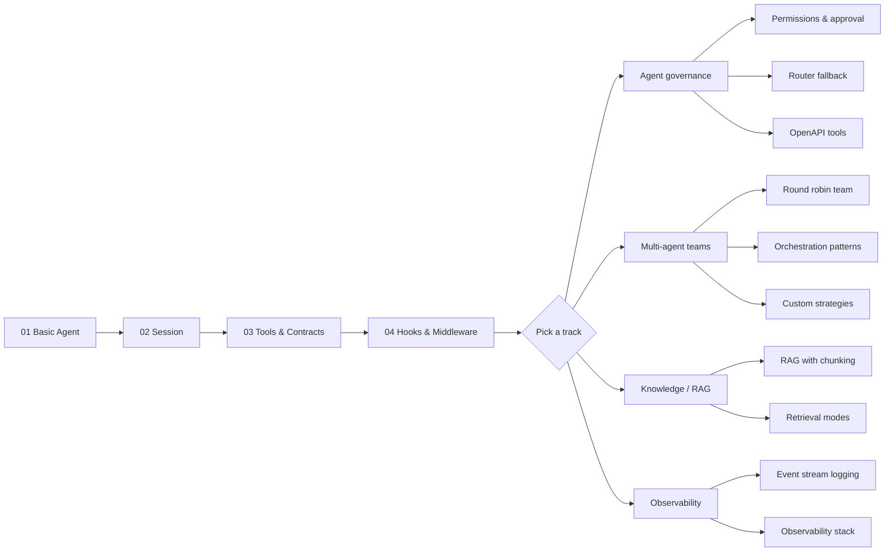

# Examples

Runnable examples demonstrating SKTK agent framework features. Most examples
call the real Claude API via `AnthropicClaudeProvider`. A few that focus on
data structures or testing patterns run offline with no API key required.

## Prerequisites

```bash
pip install -e ".[dev]"
```

Create a `.env` file in the project root with your API key:

```
ANTHROPIC_API_KEY=sk-ant-...
```

Run any example:

```bash
python examples/getting_started/01_basic_agent.py
```

## Directory layout

```
examples/
  _provider.py                   # shared helper: loads .env, returns Claude provider
  getting_started/               # numbered walkthrough (start here)
  concepts/
    agent/                       # governance, routing, OpenAPI tools
    multi_agent/                 # teams, strategies, topology DSL
      patterns/                  # 5 canonical orchestration patterns
    knowledge/                   # RAG, chunking, retrieval modes
    session/                     # blackboard shared state
    resilience/                  # retry + circuit breaker
    observability/               # tokens, audit, profiling, event streams
    testing/                     # mocks, sandboxes, prompt regression
```

## Learning path



## Quick reference

### Getting started

| Step | File | Focus | API? |
|------|------|-------|------|
| 1 | [`01_basic_agent.py`](getting_started/01_basic_agent.py) | Create and invoke an agent | yes |
| 2 | [`02_persistent_session.py`](getting_started/02_persistent_session.py) | SQLite-backed session history | no |
| 3 | [`03_tools_and_contracts.py`](getting_started/03_tools_and_contracts.py) | Tool registration, typed output contracts | yes |
| 4 | [`04_lifecycle_hooks.py`](getting_started/04_lifecycle_hooks.py) | Hooks and middleware wrappers | yes |

### Concepts

| Area | File | Focus | API? |
|------|------|-------|------|
| Agent | [`approval_permissions_rate_limits.py`](concepts/agent/approval_permissions_rate_limits.py) | PermissionPolicy, ApprovalGate, RateLimitPolicy | yes |
| Agent | [`provider_router_fallback.py`](concepts/agent/provider_router_fallback.py) | Provider registry, Router with fallback | yes |
| Agent | [`openapi_tools_end_to_end.py`](concepts/agent/openapi_tools_end_to_end.py) | Generate tools from OpenAPI spec | yes |
| Multi | [`team_with_round_robin.py`](concepts/multi_agent/team_with_round_robin.py) | Team coordination with round-robin | yes |
| Multi | [`guardrails_and_providers.py`](concepts/multi_agent/guardrails_and_providers.py) | Security filters + provider factory | yes |
| Multi | [`pipeline_topology.py`](concepts/multi_agent/pipeline_topology.py) | Pipeline DSL (`>>`) and Mermaid viz | no |
| Multi | [`custom_strategy.py`](concepts/multi_agent/custom_strategy.py) | Custom routing strategy composition | no |
| Knowledge | [`rag_with_chunking.py`](concepts/knowledge/rag_with_chunking.py) | Ingest, chunk, index, query | no |
| Knowledge | [`retrieval_modes_comparison.py`](concepts/knowledge/retrieval_modes_comparison.py) | Dense vs sparse vs hybrid | no |
| Session | [`blackboard_shared_state.py`](concepts/session/blackboard_shared_state.py) | Typed blackboard for cross-agent state | no |
| Resilience | [`resilience_patterns.py`](concepts/resilience/resilience_patterns.py) | Retry policy + circuit breaker | no |
| Observability | [`event_stream_logging.py`](concepts/observability/event_stream_logging.py) | Event sinks with structured logging | yes |
| Observability | [`observability_stack.py`](concepts/observability/observability_stack.py) | Token tracking, audit trail, profiling | yes |
| Testing | [`testing_patterns.py`](concepts/testing/testing_patterns.py) | MockKernel, sandbox, prompt regression | no |

### Orchestration patterns

| # | Pattern | File |
|---|---------|------|
| 01 | Sequential pipeline | [`patterns/01_sequential_pipeline.py`](concepts/multi_agent/patterns/01_sequential_pipeline.py) |
| 02 | Parallel fan-out/fan-in | [`patterns/02_parallel_fanout_fanin.py`](concepts/multi_agent/patterns/02_parallel_fanout_fanin.py) |
| 03 | Supervisor/worker | [`patterns/03_supervisor_worker.py`](concepts/multi_agent/patterns/03_supervisor_worker.py) |
| 04 | Reflection loop | [`patterns/04_reflection_loop.py`](concepts/multi_agent/patterns/04_reflection_loop.py) |
| 05 | Debate/consensus | [`patterns/05_debate_consensus.py`](concepts/multi_agent/patterns/05_debate_consensus.py) |

Run all patterns at once:

```bash
python examples/concepts/multi_agent/orchestration_patterns.py --pattern all
```
