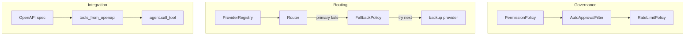

# Agent Concepts

Three examples covering governance controls, provider routing, and OpenAPI
tool generation. All call the real Claude API.

## approval_permissions_rate_limits.py

Wires three filter layers onto one agent:

1. **PermissionPolicy** — allowlist of callable tools
2. **AutoApprovalFilter + ApprovalGate** — human-in-the-loop for sensitive ops
3. **RateLimitPolicy** — throttle `invoke()` calls per time window

The tool functions (`read_docs`, `deploy_release`, `drop_database`) are local,
so the example shows the governance controls without external dependencies.

## provider_router_fallback.py

Registers `AnthropicClaudeProvider` in a `ProviderRegistry`, creates a
primary provider with a nonexistent model (guaranteed to fail) and a backup
with the real model. A `Router` with `FallbackPolicy` demonstrates automatic
failover. Uses `build_safe_agent` which also wires default safety filters.

## openapi_tools_end_to_end.py

Parses a Petstore-style OpenAPI spec with `tools_from_openapi()`, registers
the generated tool stubs on an agent, calls them directly, then invokes the
agent to produce a natural-language summary. Shows how SKTK bridges OpenAPI
specs to agent tool calling.
