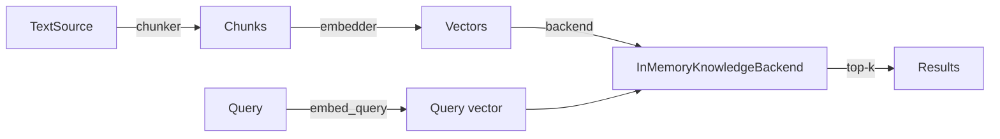

# Knowledge / RAG

Two examples demonstrating the `KnowledgeBase` retrieval pipeline. Both run
offline with a simple word-overlap embedder — no API key needed.

## rag_with_chunking.py

End-to-end RAG pipeline: ingest text sources, split with `fixed_size_chunker`,
embed and index into `InMemoryKnowledgeBackend`, then query. Shows the full
`KnowledgeBase.build()` → `query()` lifecycle.

**Key concepts:** `KnowledgeBase`, `TextSource`, `fixed_size_chunker`,
`RetrievalConfig`, `InMemoryKnowledgeBackend`

## retrieval_modes_comparison.py

Builds the same corpus three times with `DENSE`, `SPARSE`, and `HYBRID`
retrieval modes, then runs the same query against each. Demonstrates how
ranking behavior changes across modes — dense uses cosine similarity, sparse
uses BM25-style term frequency, hybrid combines both.

**Key concepts:** `RetrievalMode.DENSE`, `RetrievalMode.SPARSE`,
`RetrievalMode.HYBRID`, score differences across modes
