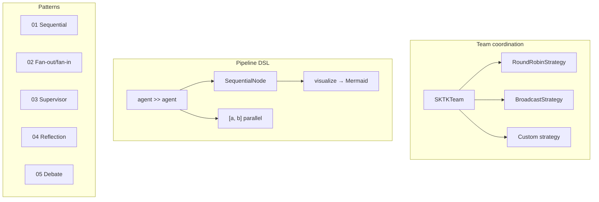

# Multi-Agent

Team coordination, pipeline topology, custom strategies, guardrails, and
five canonical orchestration patterns.



## team_with_round_robin.py

Creates a researcher/analyst/writer team with `RoundRobinStrategy` and
streams events. Each agent uses the Claude API. Shows `team.stream()` yielding
`MessageEvent` and `CompletionEvent`.

## guardrails_and_providers.py

Two demos in one file:

1. **Provider factory** — registers `AnthropicClaudeProvider` in a
   `ProviderRegistry` and calls `complete()` directly
2. **Guardrail filters** — attaches `PromptInjectionFilter` and `PIIFilter`
   to agents, showing blocked injection attempts and PII detection in outputs

## pipeline_topology.py

Builds a pipeline with the `>>` DSL operator, including a parallel fan-out
step, and prints the Mermaid diagram. No LLM needed — this focuses on the
topology data structure.

## custom_strategy.py

Implements a `SentimentBasedStrategy` that routes tasks to different agents
based on keyword matching, then composes it with `RoundRobinStrategy` using
the `|` operator for fallback. No LLM calls — demonstrates strategy routing
logic only.

## orchestration_patterns.py

Launcher script for the five pattern examples in `patterns/`. Run with:

```bash
python examples/concepts/multi_agent/orchestration_patterns.py --list
python examples/concepts/multi_agent/orchestration_patterns.py --pattern all
python examples/concepts/multi_agent/orchestration_patterns.py --pattern 03
```

See [`patterns/README.md`](patterns/README.md) for details on each pattern.
