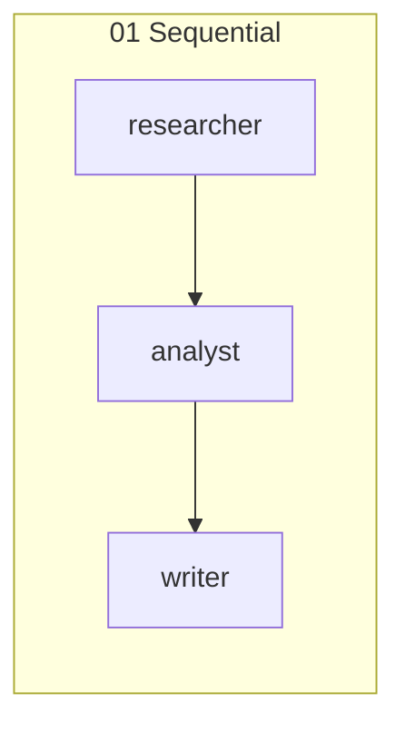
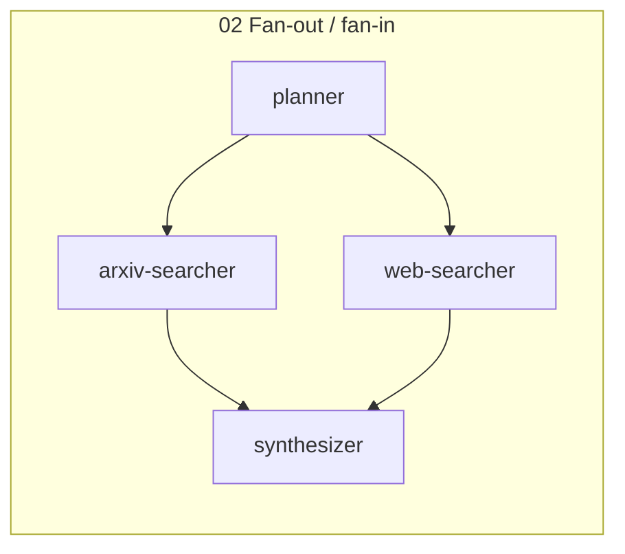
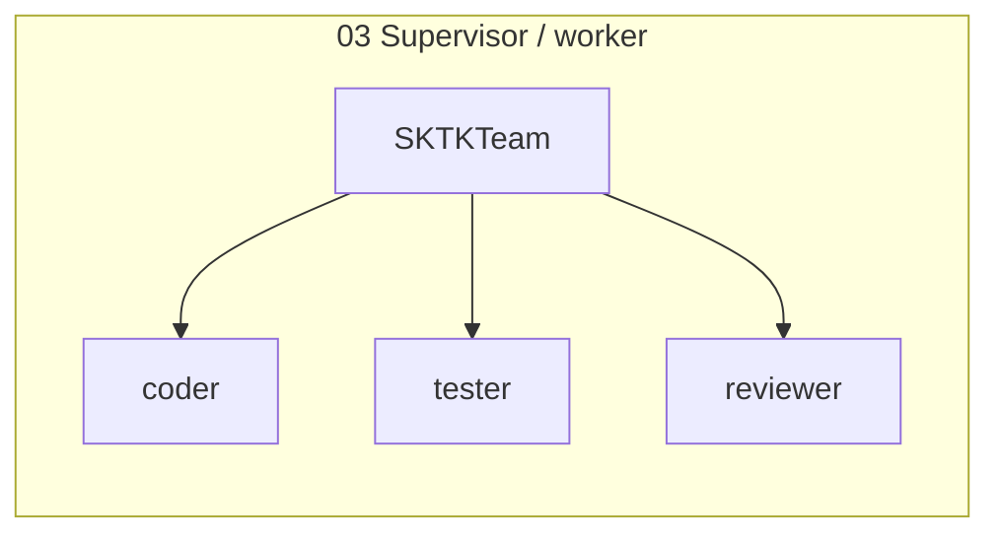
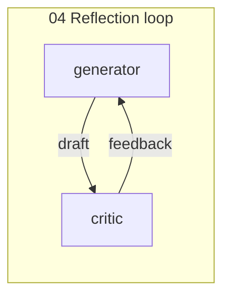
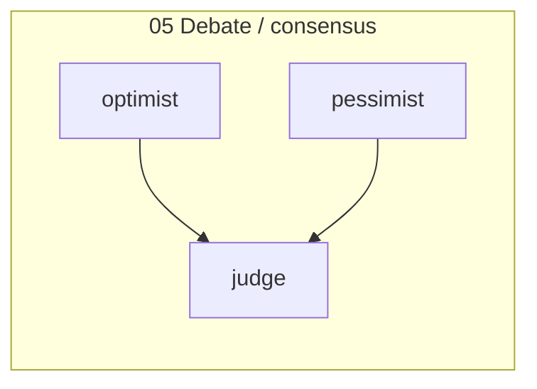

# Orchestration Patterns

Five canonical multi-agent patterns, each in a self-contained script. All use
the real Claude API.











## 01 — Sequential pipeline

Each agent's output feeds the next via the `>>` operator.
`researcher >> analyst >> writer` produces a three-stage summarization
pipeline.

## 02 — Parallel fan-out / fan-in

A planner fans the task to two searchers in parallel, then a synthesizer
merges results. Uses `AgentNode >> [a, b] >> c` topology.

## 03 — Supervisor / worker

An `SKTKTeam` with `RoundRobinStrategy` delegates sequentially to coder,
tester, and reviewer agents, simulating a code review workflow.

## 04 — Reflection loop

A generator drafts code, a critic reviews it, then the generator refines
based on feedback. Manual two-pass loop showing iterative improvement.

## 05 — Debate / consensus

Two agents argue opposing positions via `BroadcastStrategy`, then a judge
agent synthesizes a balanced verdict from both positions.

## Running

Single pattern:

```bash
python examples/concepts/multi_agent/patterns/04_reflection_loop.py
```

All at once via the launcher:

```bash
python examples/concepts/multi_agent/orchestration_patterns.py --pattern all
```
