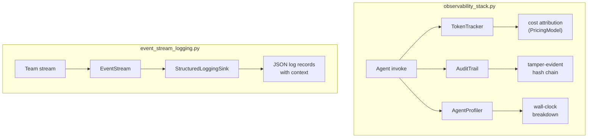

# Observability

Token tracking, audit trails, profiling, and structured event streaming.
Both examples call the real Claude API.

## observability_stack.py

Three pillars in one script:

1. **TokenTracker** — records per-invocation token usage from the provider,
   computes costs via `PricingModel`
2. **AuditTrail** — appends tamper-evident entries with chained hashes,
   supports `query()` by session and `verify_chain()` for integrity checks
3. **AgentProfiler** — measures wall-clock time per labeled section with
   `profiler.measure()` context manager, produces a breakdown summary

## event_stream_logging.py

Runs a two-agent team with `BroadcastStrategy` inside a `context_scope`,
streams events through an `EventStream` with a custom `StructuredLoggingSink`
that writes JSON log records. Demonstrates how execution context (tenant,
user, session, correlation ID) propagates into every log entry.

**Key concepts:** `EventStream`, `EventSink`, `configure_structured_logging`,
`context_scope`, `MessageEvent`, `CompletionEvent`
