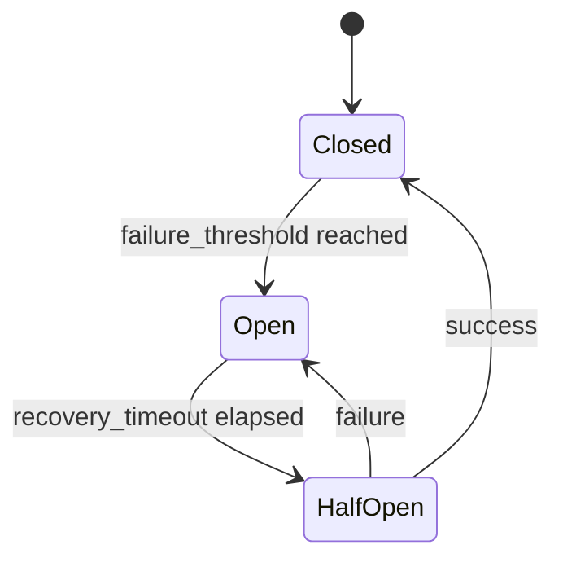

# Resilience

Retry and circuit breaker patterns for fault-tolerant agent systems.
No API key needed — uses local helper functions that simulate failures.

## resilience_patterns.py

Three demos:

1. **RetryPolicy with exponential jitter** — retries a flaky function with
   configurable backoff until it succeeds
2. **Retry exhaustion** — shows `RetryExhaustedError` when all retries fail
3. **CircuitBreaker** — tracks failures, trips open after threshold, rejects
   calls while open, transitions to half-open after recovery timeout, and
   resets on success

**Key concepts:** `RetryPolicy`, `BackoffStrategy`, `CircuitBreaker`,
`CircuitState` (closed/open/half_open), `CircuitBreakerOpenError`
