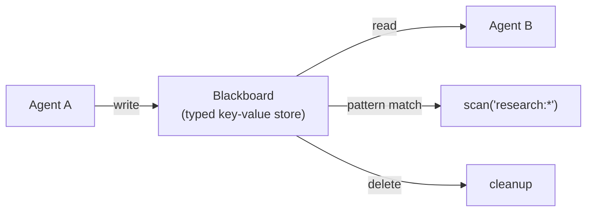

# Session

Shared state management between agents using the `Session` blackboard.
No API key needed.

## blackboard_shared_state.py

Demonstrates the `Session.blackboard` as a typed key-value store for
cross-agent coordination:

1. **Agent A** (researcher) writes structured findings under a namespaced key
2. **Agent B** (analyst) reads the findings and writes analysis
3. **Pattern scan** retrieves all keys matching a prefix (`research:*`)
4. **Delete** cleans up consumed data

**Key concepts:** `session.blackboard.put()`, `.get()`, `.scan()`, `.delete()`,
type-safe access with generics
