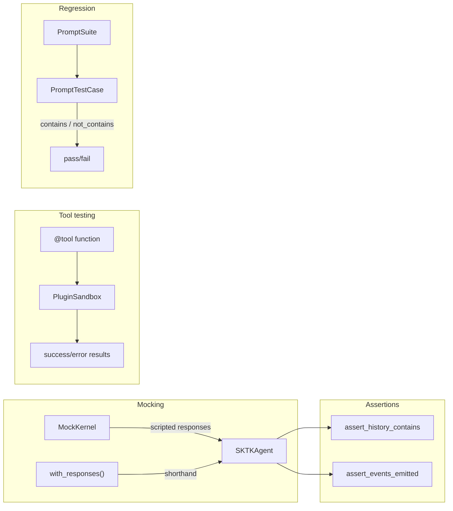

# Testing

SKTK's testing toolkit for writing fast, deterministic agent tests without
calling a live LLM. No API key needed.

## testing_patterns.py

Six testing patterns in one file:

1. **MockKernel** — queue deterministic responses, verify all consumed
2. **with_responses()** — one-liner shorthand for `MockKernel` setup
3. **Session assertions** — `assert_history_contains()` checks conversation
   history for expected role/content pairs
4. **PluginSandbox** — run `@tool` functions in isolation, capture output and
   errors without a full agent
5. **PromptSuite** — regression testing with `PromptTestCase` that checks
   `expected_contains` and `expected_not_contains` against responses
6. **Event assertions** — `assert_events_emitted()` verifies event type
   sequence from a stream

**When to use what:**

| Scenario | Tool |
|----------|------|
| Test agent logic without LLM | `MockKernel` / `with_responses()` |
| Verify conversation flow | `assert_history_contains()` |
| Test a tool function in isolation | `PluginSandbox` |
| Catch prompt regressions in CI | `PromptSuite` |
| Validate event pipeline | `assert_events_emitted()` |
