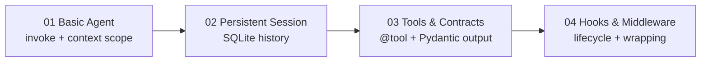

# Getting Started

Four numbered examples that walk through SKTK fundamentals. Run them in order.



## 01 — Basic agent

Creates a single `SKTKAgent` with the Claude API, invokes it inside a
`context_scope`, and prints the response. This is the minimal starting point.

```bash
python examples/getting_started/01_basic_agent.py
```

**Key concepts:** `SKTKAgent`, `context_scope`, `invoke()`

## 02 — Persistent session

Demonstrates `Session` with `SQLiteHistory` for conversation persistence.
No LLM needed — this example focuses on the storage layer.

```bash
python examples/getting_started/02_persistent_session.py
```

**Key concepts:** `Session`, `SQLiteHistory`, `history.fork()`

## 03 — Tools and contracts

Registers tools with `@tool`, inspects their JSON schemas, calls them
directly, then invokes an agent with an `output_contract` that parses
the LLM response into a typed Pydantic model.

```bash
python examples/getting_started/03_tools_and_contracts.py
```

**Key concepts:** `@tool`, `output_contract`, `MathResponse` (Pydantic)

## 04 — Lifecycle hooks and middleware

Attaches `LifecycleHooks` (start/complete/error observers) and a
`MiddlewareStack` (timing, post-processing) to agents. Shows how
cross-cutting concerns wrap `invoke()` without modifying agent logic.

```bash
python examples/getting_started/04_lifecycle_hooks.py
```

**Key concepts:** `LifecycleHooks`, `MiddlewareStack`, `stack.wrap()`
